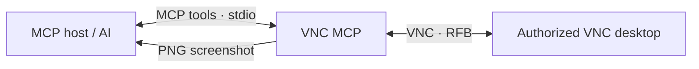

<div align="center">

# VNC MCP


[](LICENSE)

**Let your MCP-compatible AI see and control a VNC desktop.**

Screenshot-based desktop control, packaged as a Windows executable.

[Features](#features) · [Quick start](#quick-start) · [MCP setup](#mcp-setup) · [CLI](#cli) · [License](#license)

</div>

---

## At a glance

| | |
| --- | --- |
| **Interface** | MCP over stdio, plus a command-line interface |
| **VNC library** | `vncdotool` |
| **Platform** | Packaged executable for 64-bit Windows |
| **Runtime setup** | Python and VNC modules are bundled in the executable |
| **Initial developer credit** | Shinko (one of the project's initial developers) |



## Features

- Inspect the remote screen with PNG screenshots at native resolution.
- Click, move, drag, and scroll the mouse.
- Press, hold, and release keys; type text.
- Send clipboard text and read the latest text announced by the VNC server.
- Keep one connection open for MCP actions, or run one-off CLI commands.
- Connect with or without a VNC password.

> VNC input directly controls the remote computer. Connect only to systems you are authorized to use.

## Quick start

### 1. Get the executable

Download and extract `vnc-mcp-win-x64.zip`, or build it yourself on Windows with Python 3.14:

```powershell
py -3.14 --version
.\build.ps1
```

The build creates `dist/vnc-mcp.exe` and `dist/vnc-mcp-win-x64.zip`. The ZIP contains both the single-file executable and an onedir build in `vnc-mcp/`, with the README, license, and attribution notice.

### 2. Add the MCP server

Add this entry to your MCP host configuration. Replace the executable path with where you extracted it:

```json
{
  "mcpServers": {
    "vnc": {
      "command": "C:\\path\\to\\vnc-mcp.exe",
      "args": ["mcp"],
      "env": {
        "VNC_HOST": "127.0.0.1",
        "VNC_PORT": "5900",
        "VNC_PASSWORD": ""
      }
    }
  }
}
```

Restart or reload the MCP host. Connect with `vnc_connect`, then call `vnc_screenshot` to view the desktop. Use screenshot pixel coordinates for input; take another screenshot to confirm the result.

### 3. Protect credentials

The password is optional. Prefer your MCP host's protected environment or secret settings for `VNC_PASSWORD`; avoid saving real credentials in shared config files.

## MCP setup

The MCP server communicates over **stdio** and does not open a listening port. Set these optional environment variables in the MCP host:

| Variable | Default | Purpose |
| --- | --- | --- |
| `VNC_HOST` | None | Default VNC host; can instead be passed to `vnc_connect`. |
| `VNC_PORT` | `5900` | Default VNC port. |
| `VNC_PASSWORD` | None | Password for VNC servers that require one. |
| `VNC_PASSWORD_ENV` | `VNC_PASSWORD` | Name of the environment variable containing the password. |
| `VNC_TIMEOUT` | `15` | VNC operation timeout in seconds. |

### Available tools

| Group | Tools |
| --- | --- |
| Connection | `vnc_connect`, `vnc_disconnect`, `vnc_status` |
| Screen | `vnc_screenshot`, `vnc_wait` |
| Pointer | `vnc_click`, `vnc_move`, `vnc_drag`, `vnc_scroll`, `vnc_mouse_down`, `vnc_mouse_up` |
| Keyboard | `vnc_keypress`, `vnc_key_down`, `vnc_key_up`, `vnc_type` |
| Clipboard | `vnc_clipboard_set`, `vnc_clipboard_get` |

**Suggested interaction:** connect → screenshot → act using native pixel coordinates → screenshot again to verify.

## CLI

Each CLI command connects, performs one action, prints a JSON result, then disconnects. In an interactive terminal, the CLI prompts for a password without displaying it. For scripts, set `VNC_PASSWORD` or use `--password-env NAME`.

```powershell
.\vnc-mcp.exe --help
.\vnc-mcp.exe screenshot --host 127.0.0.1 --port 5900 --output screen.png
.\vnc-mcp.exe click --host 127.0.0.1 --port 5900 430 280
.\vnc-mcp.exe keypress --host 127.0.0.1 --port 5900 ctrl-alt-delete
.\vnc-mcp.exe type --host 127.0.0.1 --port 5900 "hello world"
.\vnc-mcp.exe drag --host 127.0.0.1 --port 5900 40 80 300 240
.\vnc-mcp.exe scroll --host 127.0.0.1 --port 5900 400 400 down --amount 3
.\vnc-mcp.exe clipboard-set --host 127.0.0.1 --port 5900 "hello world"
.\vnc-mcp.exe clipboard-get --host 127.0.0.1 --port 5900
```

Run commands from the folder containing `vnc-mcp.exe`, or use its full path. For command-specific options, run `vnc-mcp.exe <command> --help`. CLI commands require `--host`; `--port` defaults to `5900`. Use MCP for a persistent session across multiple actions.

## Run from source

Python 3.10 or later can run the project without the packaged executable:

```powershell
py -m pip install -r requirements.txt
py main.py --help
py main.py mcp
```

Direct runtime dependencies: `vncdotool==1.4.2` and `mcp==1.30.0`. `build.ps1` uses PyInstaller to bundle the app and its runtime dependencies.

## License

The original project code is available under the [Apache License, Version 2.0](LICENSE). You may use, modify, and redistribute it, including commercially, subject to that license. Keep the accompanying [`NOTICE`](NOTICE) attribution when redistributing this project or derivative works: **“Shinko is one of the initial developers of VNC MCP.”**

Third-party dependencies included in the executable remain under their own licenses.

---

<div align="center">
Made with care by the VNC MCP contributors · Early development credit: Shinko
</div>
